# EventPipe

[](https://github.com/sayomiyori/EventPipe/actions/workflows/ci.yml)


EventPipe — микросервисный ETL-пайплайн для обработки событий:

- **Ingest Service**: принимает события по REST/gRPC и пишет в Kafka.
- **Transform Service**: читает из Kafka, валидирует, обогащает, нормализует, сохраняет в PostgreSQL + MinIO.
- **Query Service**: отдаёт API для поиска событий, статистики и pre-signed URL на raw-данные.
- **Monitoring**: Prometheus + Grafana.
- **Deployment**: Docker Compose и Kubernetes (Minikube).

---

## Содержание

- [Архитектура](#архитектура)
- [Быстрый старт (Docker Compose)](#быстрый-старт-docker-compose)
- [API кратко](#api-кратко)
- [Локальная разработка](#локальная-разработка)
- [Kubernetes (Minikube)](#kubernetes-minikube)
- [Структура проекта](#структура-проекта)
- [Скриншоты](#скриншоты)

---

## Архитектура

1. Клиент отправляет событие в `ingest_service` (`POST /api/v1/events` или gRPC `Ingest`).
2. Ingest публикует в `events.raw` (key=`event_type`).
3. `transform_service` читает `events.raw`, запускает pipeline `validate -> enrich -> normalize`.
4. Raw JSON сохраняется в MinIO (`raw-events/{date}/{event_id}.json`).
5. Processed event сохраняется в PostgreSQL (`processed_events`).
6. Ошибки обработки после retry отправляются в `events.dlq`.
7. `query_service` отдаёт данные и pre-signed URL на raw-объект.

---

## Быстрый старт (Docker Compose)

Из корня репозитория:

```bash
docker compose up -d --build
```

Основные URL:

- Ingest REST: `http://localhost:8013`
- Ingest gRPC: `localhost:50051`
- Query REST: `http://localhost:8020`
- MinIO Console: `http://localhost:9001`
- Prometheus: `http://localhost:9095`
- Grafana: `http://localhost:3001`

Логины по умолчанию:

- MinIO: `minio` / `minio12345`

---

## API кратко

### Ingest

- `POST /api/v1/events`
- `POST /api/v1/events/batch`
- `GET /metrics`
- `GET /health`

### Query

- `GET /api/v1/events?source=&event_type=&from=&to=&page=&size=`
- `GET /api/v1/events/{event_id}`
- `GET /api/v1/events/{event_id}/raw` (307 -> pre-signed URL, 15 минут)
- `GET /api/v1/stats`
- `GET /metrics`
- `GET /health`

---

## Локальная разработка

```bash
pip install -r ingest_service/requirements.txt
pip install -r transform_service/requirements.txt
pip install -r query_service/requirements.txt
make proto
```

Запуск тестов:

```bash
make test
# или
PYTHONPATH=. python -m pytest -m "not integration" -v
```

---

## Kubernetes (Minikube)

### Prerequisites

- `kubectl`
- `minikube`

### 1) Запуск Minikube

```bash
minikube start --memory=4096
```

### 2) Сборка образов в Docker-демоне Minikube

> Важно: манифесты используют локальные образы `eventpipe-*:latest`.

**PowerShell**

```powershell
& minikube -p minikube docker-env --shell powershell | Invoke-Expression
docker build -f ingest_service/Dockerfile -t eventpipe-ingest:latest .
docker build -f transform_service/Dockerfile -t eventpipe-transform:latest .
docker build -f query_service/Dockerfile -t eventpipe-query:latest .
```

**bash**

```bash
eval "$(minikube docker-env)"
docker build -f ingest_service/Dockerfile -t eventpipe-ingest:latest .
docker build -f transform_service/Dockerfile -t eventpipe-transform:latest .
docker build -f query_service/Dockerfile -t eventpipe-query:latest .
```

### 3) Ingress addon

```bash
minikube addons enable ingress
```

### 4) Применение манифестов

```bash
kubectl apply -f k8s/namespace.yaml
kubectl apply -f k8s/ --recursive
kubectl get pods -n eventpipe
```

Для быстрого доступа к Ingest Service:

```bash
minikube service ingest-service -n eventpipe
```

### 5) Скейлинг Transform

```bash
kubectl scale deployment transform --replicas=4 -n eventpipe
```

---

## Структура проекта

```text
eventpipe/
├── proto/
├── ingest_service/
├── transform_service/
├── query_service/
├── monitoring/
├── k8s/
├── docs/images/
├── docker-compose.yml
└── Makefile
```

---

## Скриншоты

Ниже приведены скриншоты ключевых этапов развёртывания, проверки API, хранения данных и мониторинга.

### Docker / сервисы

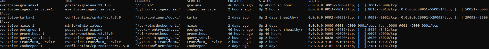
*Поднятые сервисы в Docker Compose.*

### Ingest API (Swagger)

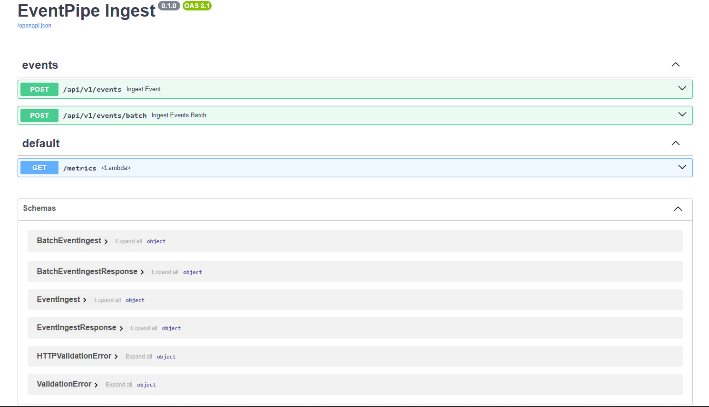
*Проверка REST endpoint-ов Ingest Service.*

### Query API (Swagger)

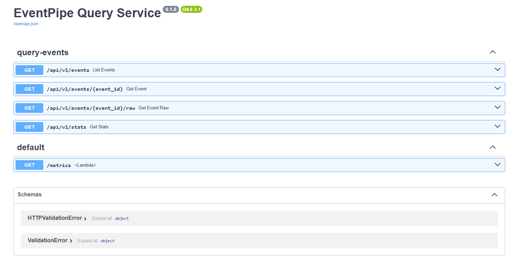
*Проверка endpoint-ов Query Service.*

### Kafka consumer

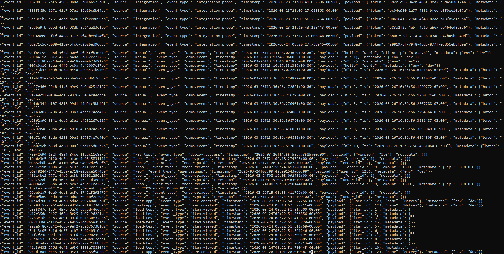
*Чтение сообщений из Kafka (`events.raw` / `events.dlq`).*

### Transform logs

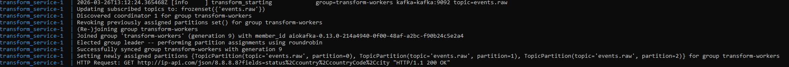
*Логи transform-консьюмера и pipeline-обработки.*

### PostgreSQL results

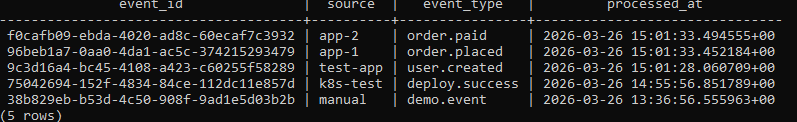
*Сохранённые processed events в таблице PostgreSQL.*

### MinIO bucket

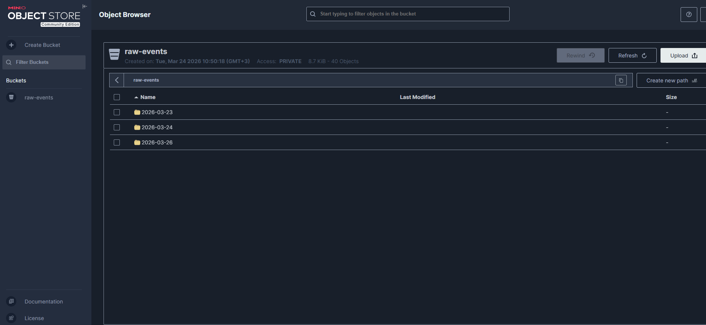
*Raw-события в бакете `raw-events`.*

### Query stats response

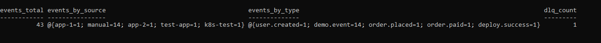
*Ответ `GET /api/v1/stats` (агрегаты + dlq_count).*

### Prometheus metrics

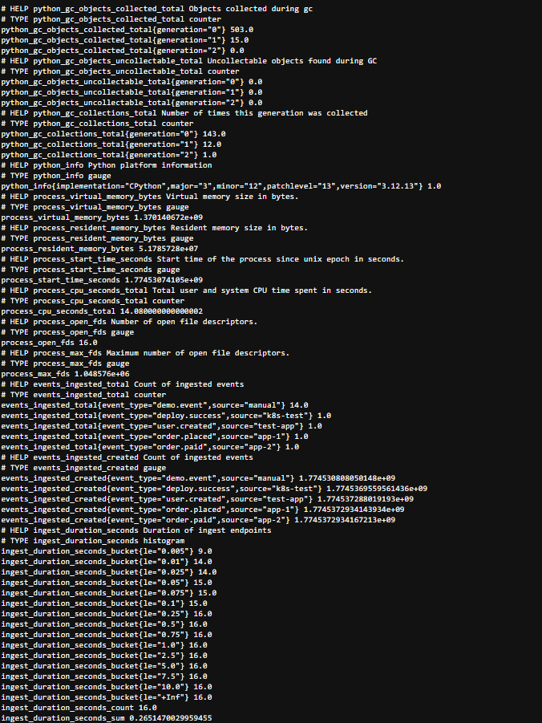
*Скрапинг метрик сервисов.*

### Grafana dashboard

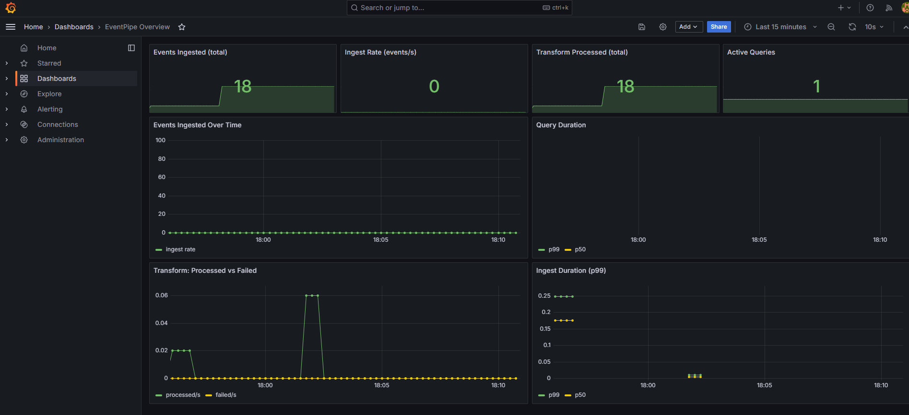
*Дашборд мониторинга EventPipe.*

### Kubernetes pods

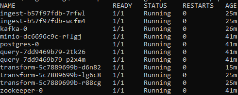
*Поднятые pod'ы в namespace `eventpipe`.*

### Kubernetes scale

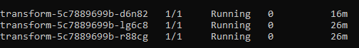
*Скейлинг `transform` deployment.*
